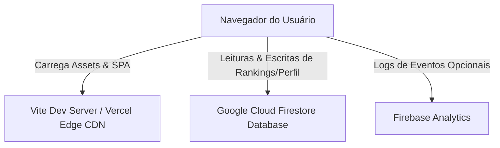

# Arquitetura do Software — Portfólio Profissional

Esta documentação descreve a arquitetura geral da aplicação, padrões de projeto e decisões de design de software.

---

## 1. Visão Geral da Arquitetura

O portfólio profissional do Prof. Alexsander Farias é estruturado como uma **Single Page Application (SPA)** de alta performance, utilizando a biblioteca **React 19** e o empacotador **Vite**.



---

## 2. Estrutura de Diretórios Organizacional

Após a refatoração, o projeto separa rigidamente arquivos utilitários de build, suítes de teste e fontes de produção:

```
├── .git/                      # Controle de versão
├── docs/                      # Documentações Técnicas e Arquitetura
│   ├── AUDITORIA_TECNICA.md
│   ├── PLANO_DE_REFATORACAO.md
│   ├── ARQUITETURA.md
│   ├── DESIGN_SYSTEM.md
│   ├── DEPLOY.md
│   └── SEGURANCA.md
├── public/                    # Ativos estáticos públicos do servidor
│   ├── fametro/               # Quizzes, simulações e dashboards acadêmicos
│   ├── hackersdobem/          # PDFs e apostilas do curso
│   └── Foto_Perfil_Round.png  # Imagem principal (LCP)
├── scripts/                   # Utilitários de processamento e scripts de build
│   ├── extract_all.js         # Processador em lote de PDFs
│   ├── extract_pdf.js         # Extrator unitário de texto de PDF
│   └── update_css.cjs         # Script de reestilização
├── src/                       # Código-fonte da aplicação React
│   ├── assets/                # Imagens e logotipos de desenvolvimento
│   ├── components/            # Componentes visuais globais e de layout
│   ├── data/                  # Fontes de dados estruturados (content.js)
│   ├── hooks/                 # Custom React Hooks
│   ├── pages/                 # Páginas e views de rotas principais
│   ├── sections/              # Componentes de seção da página inicial
│   ├── App.jsx                # Componente raiz de roteamento
│   ├── main.jsx               # Ponto de entrada de renderização
│   └── index.css              # Design System e CSS Global
├── tests/                     # Suíte de Testes (Vitest)
│   ├── fixtures/              # Dados estáticos e mocks de teste (PDFs)
│   ├── setup.js               # Arquivo de bootstrap dos testes
│   ├── content.test.js        # Testes de integridade da camada de dados
│   ├── routing.test.js        # Testes de roteamento das páginas
│   ├── security.test.js       # Testes de vulnerabilidades e LGPD
│   └── seo.test.js            # Testes de marcações e sitemaps
├── package.json               # Gerenciador de dependências e scripts npm
├── vite.config.js             # Configurações do Vite e Vitest
└── firestore.rules            # Regras de segurança de acesso ao Firestore
```

---

## 3. Roteamento do Cliente

O roteamento é gerenciado em ambiente client-side utilizando a biblioteca `react-router-dom`:
- **Rota Raiz (`/`)**: Exibe o portfólio unificado contendo as seções de Hero, Sobre Mim, Competências, Projetos, Depoimentos, Trajetória e Contato.
- **Rotas Secundárias (`/feedback`, `/teste-afinidade`, `/mentoria`)**: Carregadas condicionalmente via **Lazy Loading** (`Suspense` e `React.lazy`) para evitar o inchaço do bundle inicial e acelerar o LCP.
- **Rotas Acadêmicas (`/fametro`, `/hackersdobem`)**: Conectam os estudantes com os Simulados N2, rankings e avaliações comportamentais integradas de forma reativa.
- **Rota de Erro (`*`)**: Redirecionamento automático de endereços inexistentes para a página `NotFound` customizada.

---

## 4. Integração com Banco de Dados Firestore

A aplicação utiliza o SDK do **Firebase** para persistir e buscar informações em tempo real:
- **Coleção `fametro_ranking`**: Utilizada para armazenar as pontuações e durações dos simulados executados pelos alunos do CEUNI-FAMETRO.
- **Coleção `perfil_comportamental`**: Armazena as estatísticas do questionário comportamental de 25 questões baseado na metodologia Ned Herrmann.
- **Coleção `feedbacks`**: Recebe os depoimentos submetidos diretamente pelo site para exibição dinâmica no carrossel de depoimentos.
